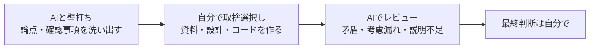

# 浅妻 利明 / Software Engineer

**曖昧なアイデアや要求を整理して、実際に動くもので検証できる形にするエンジニアです。**

1998年から25年以上、Webシステムの企画・要件定義・設計・開発・運用に携わってきました。
要件やドキュメントが揃っていない状況で、要求・制約・未決事項を整理し、実装や検証ができる課題に分解する仕事を得意としています。

現在は **生成AIを開発プロセスにどう組み込めばエンジニアの力を伸ばせるか** を、個人プロジェクト **[ex-day](https://github.com/ex-day)** で実践しています。

---

## 🤝 こんな方とつながりたいです

| | |
|---|---|
| 💼 **お仕事を相談したい方** | 要件整理・方式検討、プロトタイプ / PoC、既存システムの解析、性能問題の切り分けなど → [連絡先](#-contact) |
| 🚀 **ex-dayに参加したい方** | 開発だけでなく、地域情報の提供や企画など、さまざまな関わり方を歓迎します → [ex-day](https://github.com/ex-day) |
| 🤖 **AIを使った開発について話したい方** | AIとの役割分担、ワークフロー、プロンプトの工夫などについて情報交換しましょう |

---

## 🚀 ex-day ― いつもの一日に、ちょっとした発見を

場所・時間・興味をもとに、歴史、地域の出来事、イベント、旬のものなど、「ちょっと寄り道してみよう」と思える情報との出会いをつくるプロジェクトです。

1998年に立ち上げた会社で、趣味や地域に特化したコミュニティサイトを企画・運営していました。
**「地域の情報で、人と場所をつなぐ」** というテーマに、あらためてAIを使った開発で取り組んでいるのがex-dayです。

- 📍 現在:構想・プロトタイプ段階
- 📝 **AIとのやりとり(プロンプトと結果)を [`docs/ai/`](https://github.com/ex-day/platform/tree/main/docs/ai) で公開しています（現在公開準備中）**
- 🙌 募集している仲間:開発者 / 企画 / 地域・歴史情報に詳しい方

---

## 🤖 AIとの役割分担

AIに任せきりにはせず、**論点の洗い出しと見落としのチェックにAIを使い、構成と最終判断は自分で行う**という進め方をしています。

**使っているツール**:Claude / GitHub Copilot
**使っている場面**:要求整理、技術調査・比較、アーキテクチャ検討、実装・レビューの補助、ドキュメント作成

---

## 🔍 主な実績(抜粋)

- **SDV開発基盤(自動車メーカー向け)**:HILS接続時の通信遅延を、ネットワーク・通信方式・シミュレーション負荷に分けて検証し、ボトルネックを特定。VEOSとAWS環境でRTFを測定・分析
- **仮想環境構築フレームワーク**:要求・制約・未決事項を整理し、ベンダーとの論点調整やアーキテクチャ案の比較検討を推進
- **大規模データの性能調査**:数千万件規模のテーブルでインデックスが効いていないことを特定し、改善方針を整理
- **技術選定**:保守性に課題のあるライブラリを調査し、代替ライブラリへの移行を提案・実施
- **技術面での調整・支援**:ベンダー(オフショアを含む)や関係者との論点調整、コードレビュー、メンバーへの技術支援。要件定義から運用まで一通り経験

---

## 💻 技術スタック

| 分野 | 技術 |
|---|---|
| Frontend | TypeScript / React / Vue.js / Next.js |
| Backend | Java / Spring Boot / PHP / Laravel / Python |
| Data | MySQL / PostgreSQL / PostGIS / Oracle |
| Cloud / Infra | AWS / Docker / GitHub Actions / Jenkins / Linux |
| その他 | OpenAPI / SDVシミュレーション環境(VEOS・HILS) |

---

## 🧪 興味のあるテーマ

生成AI × ソフトウェアエンジニアリング / 位置情報サービス / 地域・歴史情報のデジタル活用 / プロトタイピング / Developer Experience / シミュレーション・仮想開発環境

---

## 📫 Contact

お仕事のご相談や、ex-dayへの参加などはお気軽にどうぞ。

- ✉️ Email:`asazuma.work [at] gmail.com`
- 💬 ex-dayについて:[Discussions](https://github.com/orgs/ex-day/discussions)
<!-- Zenn / X / LinkedIn などを始めたらここに追加 -->
